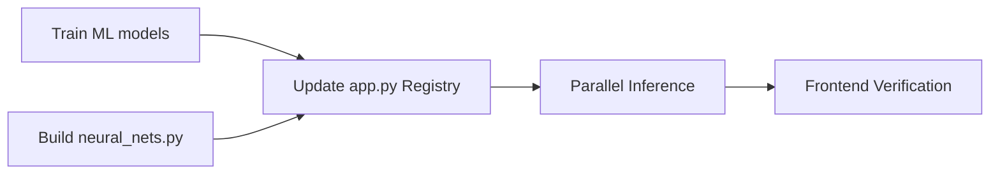

# 🧠 NeuroPulse 10-Model Architecture — Execution Plan

## Target: 10 Simultaneous Models

| # | Model | Category | Source |
|---|-------|----------|--------|
| 1 | SVM (Linear) | Classic ML | `svm_model.pkl` ✅ exists |
| 2 | Logistic Regression | Classic ML | `logreg_model.pkl` ✅ exists |
| 3 | Random Forest | Classic ML | `rf_model.pkl` ⬜ train |
| 4 | XGBoost | Classic ML | `xgb_model.pkl` ⬜ train |
| 5 | Naive Bayes | Classic ML | `nb_model.pkl` ⬜ train |
| 6 | LSTM | Deep Learning | `neural_nets.py` ⬜ build |
| 7 | CNN | Deep Learning | `neural_nets.py` ⬜ build |
| 8 | DistilBERT | Transformer | HuggingFace ⬜ add |
| 9 | BERT | Transformer | HuggingFace ✅ exists |
| 10 | RoBERTa | Transformer | HuggingFace ✅ exists |

---

## Execution Tasks

### Task A: `train_sentiment.py` — Train RF, XGBoost, Naive Bayes
- Load existing `tfidf_vectorizer.pkl` instead of re-fitting
- Train RandomForest, XGBoost, MultinomialNB
- Save as `rf_model.pkl`, `xgb_model.pkl`, `nb_model.pkl`
- Print classification reports

### Task B: `neural_nets.py` — LSTM + CNN pipeline
- Keras tokenizer + pad_sequences
- 1D-CNN model + Bidirectional LSTM model
- Train on Tweets.csv, save weights to `models/`
- Expose `load_neural_models()` and `predict_neural()` functions

### Task C: `app.py` — Full 10-model registry + DistilBERT
- Add Naive Bayes, RF, XGBoost pkl loading
- Add DistilBERT transformer
- Add neural net (LSTM, CNN) loading
- Wire all into MODEL_REGISTRY

### Task D: `inference.py` — concurrent.futures parallel inference
- `ThreadPoolExecutor` for all 10 models
- Each model runs in its own thread
- Timeout per model to prevent hangs
- Return timing data per model

### Task E: Frontend — enhanced table with model category badges
- Add "Deep Learning" type badge
- Display latency per model
- Show model count badge updating to 10

